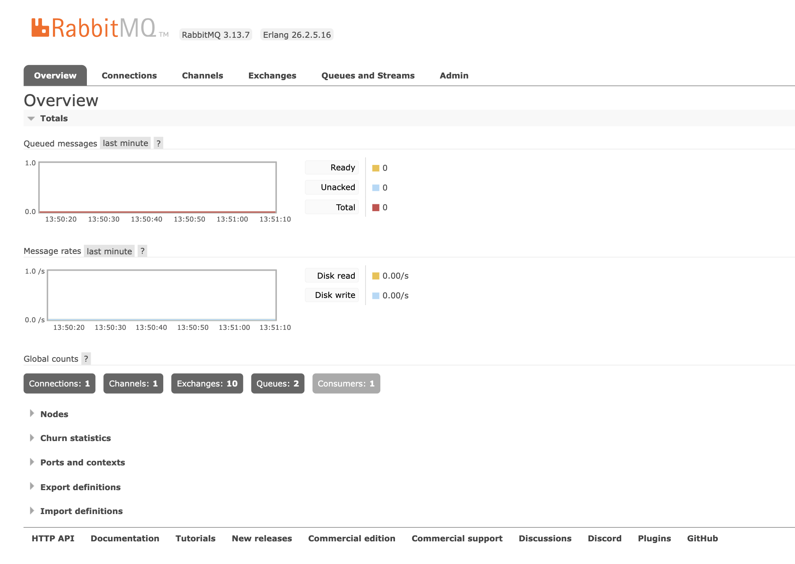
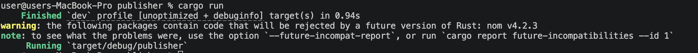
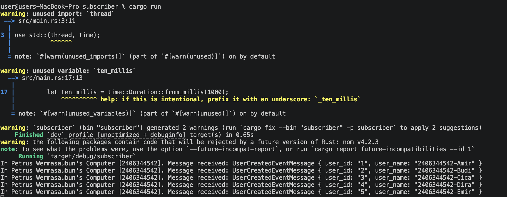
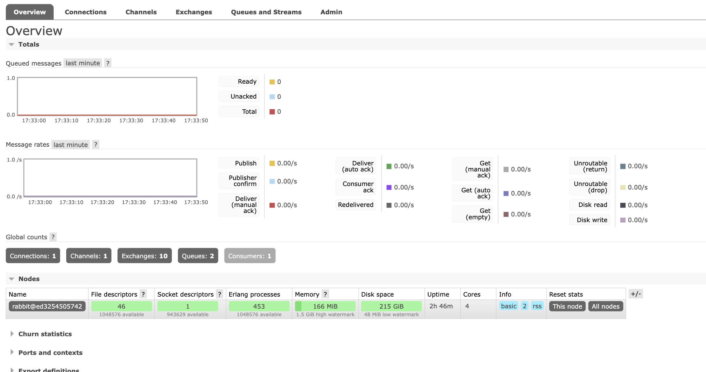

a. Berapa banyak data yang dikirim program publisher dalam satu kali jalan?
Dalam satu kali saya menjalankan program publisher, ada 5 buah data (atau event) yang dikirim ke RabbitMQ. Data ini isinya adalah UserCreatedEventMessage untuk lima orang yang berbeda, yaitu Amir, Budi, Cica, Dira, dan Emir. Jadi, setiap kali program publisher dieksekusi sampai selesai, dia bakal memicu lima pesan sekaligus untuk masuk ke dalam antrean.

b. Apa artinya alamat URL-nya sama dengan program subscriber?
Alamat URL yang sama itu artinya kedua program saya, baik si publisher maupun si subscriber, lagi ngobrol di "ruangan" atau alamat yang sama. Ibaratnya, publisher tahu ke mana harus naruh surat, dan subscriber tahu harus nungguin surat di kotak pos yang mana. Karena alamatnya sama-sama ke localhost:5672, mereka berdua jadi bisa terhubung ke satu message broker (RabbitMQ) yang sama yang lagi jalan di Docker saya.

1. 

2.

Di gambar dashboard RabbitMQ, poin yang paling penting itu ada di bagian Connections yang menunjukkan angka 1. Ini adalah bukti kalau program Subscriber saya sudah berhasil running dan terhubung dengan benar ke si message broker. Jadi, status koneksi ini ibaratnya jalur pipa yang sudah tersambung; si Subscriber sekarang posisinya lagi standby dan siap banget buat menangkap pesan apa pun yang masuk ke antrean user_created secara real-time.

Nah, pas saya jalanin program Publisher, dia langsung ngirim 5 event sekaligus ke RabbitMQ. Karena si Subscriber tadi sudah standby, semua pesan itu langsung disambar dan diproses detik itu juga, makanya log pesannya muncul beruntun di terminal. Alasan kenapa angka Ready di dashboard tetap nol itu bukan karena pengirimannya gagal, tapi karena prosesnya saking cepatnya—pesan yang masuk langsung habis diambil oleh Subscriber tanpa sempat antre lama-lama di dalam broker.

